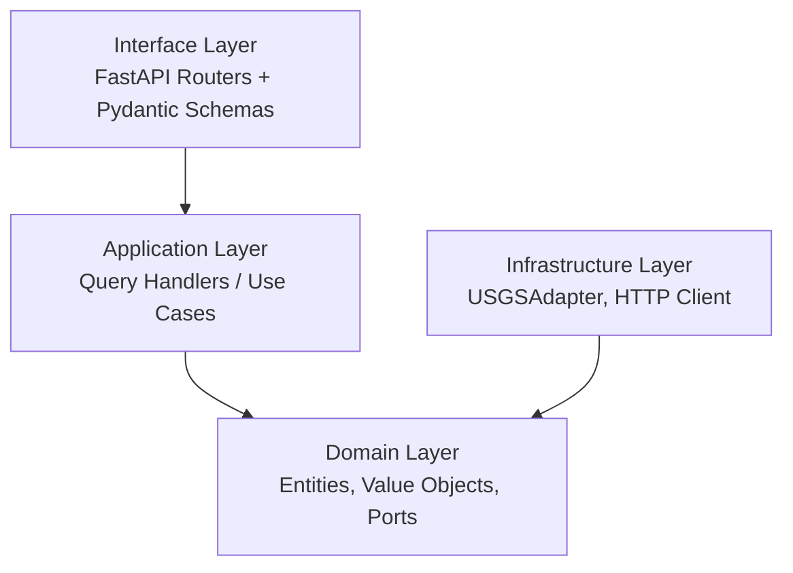

## Paradigm

**Clean / Hexagonal Architecture** — domain logic is the center; all frameworks, HTTP clients, and external services are adapters at the edges. Dependency direction is strictly inward: `interface → application → domain`; `infrastructure` implements domain ports and is never imported by `application` or `domain` directly.



---

## Architecture Decisions

### AD-1 — Framework: FastAPI 0.141.1 on Python 3.13

- **Binds:** All HTTP services are FastAPI ASGI apps; Python runtime is 3.13.
- **Prevents:** Mixing Flask, Express, or other frameworks.
- **Rule:** FastAPI is the sole HTTP framework. Auto-generated Swagger UI served at `/docs`, ReDoc at `/redoc` — no extra packages required. OpenAPI 3.1.0 spec auto-generated from type annotations.

### AD-2 — Four-Layer Clean Architecture

- **Binds:** Source code is organized into four layers: `domain/`, `application/`, `infrastructure/`, `interface/`.
- **Prevents:** FastAPI, httpx, or Pydantic imports inside `domain/`; direct use of `infrastructure/` from `interface/`.
- **Rule:** `domain/` has zero external dependencies (no `import fastapi`, no `import httpx`, no `import pydantic`). `interface/` depends only on `application/`. `infrastructure/` implements interfaces defined in `domain/`.

### AD-3 — Single Bounded Context: `earthquake`

- **Binds:** All business logic lives under the `earthquake` bounded context for v1.
- **Prevents:** God classes, scattered domain logic, or a second context before v1 is stable.
- **Rule:** Domain entities: `Earthquake`. Value objects: `Magnitude`, `Depth`, `Coordinates`, `EarthquakeFilter`. Repository port: `EarthquakeRepository` (abstract class in `domain/`).

### AD-4 — TDD: Tests First, Always

- **Binds:** Every implementation file has a corresponding test file written before the implementation.
- **Prevents:** Code without coverage; tests as afterthought.
- **Rule:** Red → Green → Refactor, no exceptions. `tests/` mirrors `src/dark_factory/` structure. Unit tests use `pytest` with mocked ports; integration tests use `httpx.AsyncClient` + `ASGITransport`. Marker: `@pytest.mark.anyio` for async tests.

```
tests/
├── unit/
│   ├── domain/         # Entity and value object logic
│   └── application/    # Use case handlers with mocked repos
└── integration/
    ├── infrastructure/ # USGSAdapter against real or mocked USGS
    └── interface/      # Full HTTP round-trip via ASGITransport
```

### AD-5 — USGS Integration: Port / Adapter

- **Binds:** `EarthquakeRepository` abstract interface lives in `domain/earthquake/repositories.py`. `USGSAdapter` lives in `infrastructure/usgs/adapter.py`.
- **Prevents:** Direct USGS HTTP calls from `application/` or `domain/`; leaking USGS GeoJSON structure into domain entities.
- **Rule:** The domain never knows about USGS, `httpx`, or any URL. `USGSAdapter` translates USGS GeoJSON → `Earthquake` domain entities. A `FakeEarthquakeRepository` in `tests/` enables unit testing without network calls.

### AD-6 — Response Format: Accept Header Negotiation

- **Binds:** A single `GET /api/v1/earthquakes` endpoint; format is controlled by the `Accept` header.
- **Prevents:** Separate `/earthquakes/json` and `/earthquakes/geojson` endpoints.
- **Rule:** `Accept: application/json` (default) → simplified flat JSON. `Accept: application/geo+json` → native GeoJSON (FeatureCollection). Same filters apply to both.

### AD-7 — URL Versioning: `/api/v1/`

- **Binds:** All public endpoints are prefixed with `/api/v1/`.
- **Prevents:** Breaking changes reaching consumers without version control.
- **Rule:** Router mounted at `/api/v1`. Future breaking changes introduce `/api/v2/` without removing v1. `/health` and `/docs` live outside the versioned prefix.

### AD-8 — Stateless Proxy: No Persistence in v1

- **Binds:** No database, no cache, no file storage.
- **Prevents:** Accidental stateful drift; infra complexity for v1.
- **Rule:** Every request is proxied directly to USGS. Response is never stored. `httpx.AsyncClient` is initialized at startup and shared via FastAPI dependency injection.

### AD-9 — Deployment: Render + GitHub Actions

- **Binds:** Deploy target is Render (free tier); CI/CD pipeline is GitHub Actions.
- **Prevents:** Ad-hoc deploys or multi-cloud drift in v1.
- **Rule:**
  - `ci.yml` — runs on every PR: `pytest`, lint (`ruff`), type check (`mypy`).
  - `deploy.yml` — triggered on merge to `main` or manual dispatch: triggers Render deploy hook via `curl $RENDER_DEPLOY_HOOK_URL`.
  - **Free tier caveat:** Render spins down after 15 min idle. Acceptable for demo (API is warm during the live session). For persistent availability, add UptimeRobot (free) pinging `/health` every 14 min.

### AD-10 — Config: pydantic-settings + Environment Variables

- **Binds:** All configuration is loaded from environment variables at startup via `pydantic-settings`.
- **Prevents:** Hardcoded URLs, secrets, or magic strings in source code.
- **Rule:** Single `config.py` with a `Settings` class. `.env.example` documents every variable. Render env vars configured via dashboard; never committed.

### AD-11 — Package Manager: uv

- **Binds:** `uv` is the sole package manager; `pyproject.toml` is the single source of truth for deps and tooling.
- **Prevents:** `pip`, `pip-tools`, or `poetry` usage; `requirements.txt` drift.
- **Rule:** `uv sync` installs; `uv run pytest` runs tests. `uv.lock` committed for reproducible builds.

---

## Project Structure (Seed)

> True at cold-start. Owned by the code once it exists.

```
dark-factory/
├── src/
│   └── dark_factory/
│       ├── domain/
│       │   └── earthquake/
│       │       ├── entities.py        # Earthquake dataclass
│       │       ├── value_objects.py   # Magnitude, Depth, Coordinates
│       │       ├── repositories.py    # EarthquakeRepository (ABC)
│       │       └── filters.py         # EarthquakeFilter dataclass
│       ├── application/
│       │   └── earthquake/
│       │       ├── queries.py         # GetEarthquakes, GetEarthquakeById
│       │       └── handlers.py        # Query handlers (depend on repo port)
│       ├── infrastructure/
│       │   └── usgs/
│       │       ├── adapter.py         # USGSAdapter implements EarthquakeRepository
│       │       ├── client.py          # httpx.AsyncClient wrapper
│       │       └── mappers.py         # USGS GeoJSON → Earthquake entity
│       ├── interface/
│       │   └── http/
│       │       ├── v1/
│       │       │   ├── earthquakes.py # FastAPI router
│       │       │   └── schemas.py     # Pydantic request/response schemas
│       │       └── dependencies.py    # DI: wire repo + handler
│       ├── config.py                  # pydantic-settings Settings class
│       └── main.py                    # App factory: create_app()
├── tests/
│   ├── conftest.py                    # AsyncClient fixture, FakeRepo
│   ├── unit/
│   │   ├── domain/
│   │   └── application/
│   └── integration/
│       ├── infrastructure/
│       └── interface/
├── .github/
│   └── workflows/
│       ├── ci.yml
│       └── deploy.yml
├── pyproject.toml
├── .env.example
└── README.md
```

---

## Endpoints (Seed)

| Method | Path | Description |
|--------|------|-------------|
| GET | `/api/v1/earthquakes` | List earthquakes with filters |
| GET | `/api/v1/earthquakes/{id}` | Single earthquake by USGS event ID |
| GET | `/api/v1/earthquakes/recent` | Last 24 h, magnitude ≥ 2.5 |
| GET | `/health` | Health check — confirms USGS upstream reachable |
| GET | `/docs` | Swagger UI (auto-generated) |
| GET | `/redoc` | ReDoc (auto-generated) |

---

## Deferred

| Item | Revisit condition |
|------|-------------------|
| Response caching | When USGS rate limits become a problem |
| Rate limiting | When the API is opened beyond demo use |
| Auth / API keys | When multi-tenant or paid access is needed |
| Reverse geocoding (country/city) | Post-v1 feature request |
| WebSocket / SSE streaming | If a consumer needs push instead of poll |
| Second bounded context | When a non-earthquake domain is introduced |
| Persistent free-tier hosting | When demo transitions to production |

---

## Key Dependencies (Seed)

```toml
[project]
requires-python = ">=3.13"

[project.dependencies]
fastapi = ">=0.141.1"
pydantic-settings = ">=2.0"
httpx = ">=0.28.1"
uvicorn = {extras = ["standard"], version = ">=0.30"}

[project.optional-dependencies]
dev = [
    "pytest>=8.0",
    "anyio[trio]>=4.0",
    "pytest-anyio>=0.0.0",
    "ruff>=0.5",
    "mypy>=1.10",
]
```
